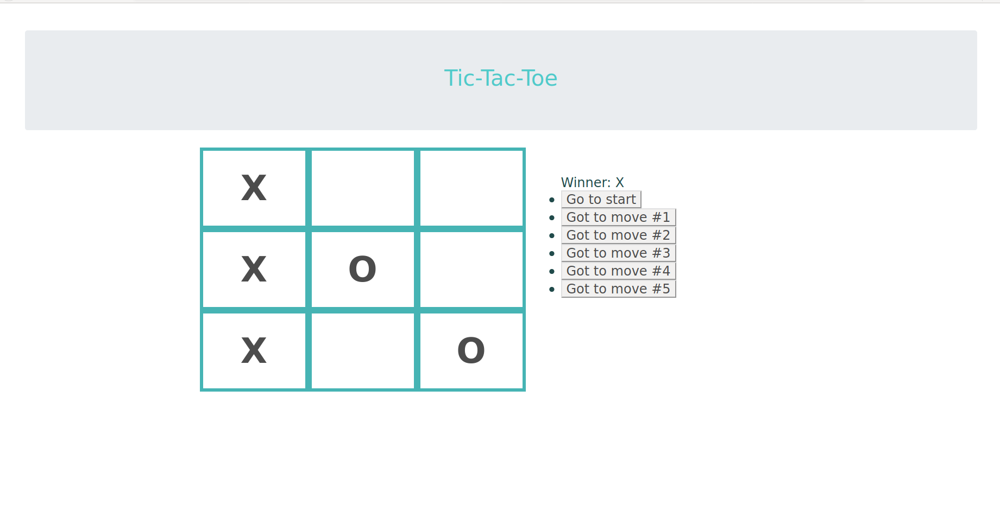

# Tic-Tac-Toe

React

A game built with HTML, CSS, React and bootstrap.

You can see and play with [live demo](https://ayseakyol-tic-tac-toe.herokuapp.com/).

It looks something like this:

---

## Notes

Studying this project I learned about:

- React hooks
- Making full stack project

This resource was very helpful:

[Introducing Hooks:](https://reactjs.org/docs/hooks-intro.html)

Tic-tac-toe game can be played and players can go to the back in their play with using buttons.
